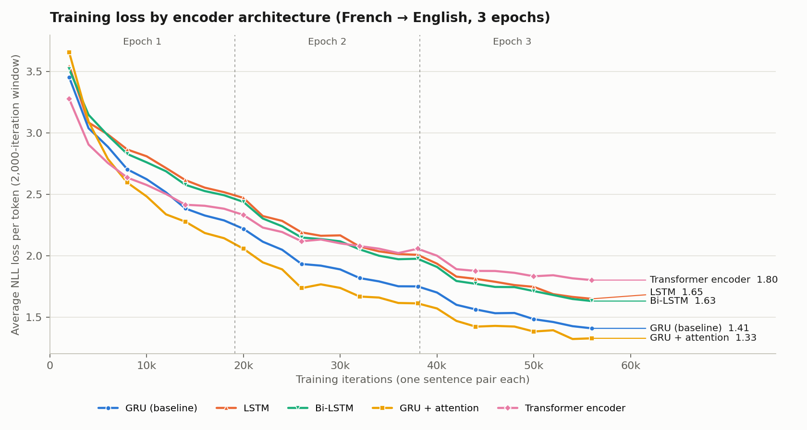

# Seq2Seq Machine Translation: Encoder Architecture Comparison

[](https://www.python.org/)
[](https://pytorch.org/)
[](https://colab.research.google.com/github/simonanana/Sequence-to-Sequence-Machine-Translation-Architecture-Comparison/blob/main/seq2seq_machine_translation.ipynb)

A controlled comparison of five encoder designs for **French → English** neural machine
translation, implemented in PyTorch and evaluated with ROUGE-1 and ROUGE-2 F1 on a held-out test set.

*Coursework for MH6812, Nanyang Technological University. The data pipeline and the baseline GRU
encoder–decoder are adapted from the PyTorch tutorial
[NLP From Scratch: Translation with a Sequence to Sequence Network and Attention](https://pytorch.org/tutorials/intermediate/seq2seq_translation_tutorial.html).*

## Repository contents

```
seq2seq-machine-translation-architecture-comparison/
├── seq2seq_machine_translation.ipynb   # Corrected notebook for all five experiments
├── loss_comparison.png                 # Training loss curves from the original run
├── results/
│   └── original_run_log.txt            # Full output of the original run (source of all reported numbers)
└── README.md
```

Re-running the notebook writes `results/results.csv` and `results/loss_comparison_rerun.png`.

## Data

| Item | Value |
|---|---|
| Source | Tatoeba English–French pairs via [manythings.org](http://www.manythings.org/anki/) (`fra-eng.zip`) |
| Direction | French (source) → English (target) |
| Filtering | Both sides shorter than 15 words; English side starts with *i am, he is, she is, you are, we are, they are* (or their contractions) |
| Pairs | 239,189 read, 21,228 kept |
| Split | 90 / 10: 19,105 training and 2,123 test pairs (`random_state=42`) |
| Vocabulary | French 6,376 words, English 4,210 words (including SOS and EOS) |

## Setup

All five experiments share the same settings:

| Setting | Value |
|---|---|
| Hidden size | 256 |
| Epochs | 3 (57,315 single-pair updates) |
| Optimiser | SGD, learning rate 0.01 |
| Loss | Negative log-likelihood |
| Teacher forcing | Applied to a whole sentence with probability 0.5 |
| Decoding | Greedy, at most 15 tokens |
| Metric | ROUGE-1 and ROUGE-2 F1 on the 2,123 test pairs |

### Architectures

| Exp | Encoder | Decoder | Notes |
|:---:|---|---|---|
| 1 | GRU | GRU | Baseline: the encoder's final state initialises the decoder |
| 2 | LSTM | LSTM | Hidden and cell states passed to the decoder |
| 3 | Bi-LSTM | LSTM | The two directions' final states are summed (see Limitations) |
| 4 | GRU | GRU + attention | Additive (Bahdanau-style, concat) scoring, `vᵀ tanh(W[s; hᵢ])`, computed for all source positions at once |
| 5 | Transformer encoder | GRU | 2 layers, 8 heads, learnable positional embeddings; outputs mean-pooled into one vector that initialises the decoder |

## Results

Single run on a Google Colab GPU. Full output: [`results/original_run_log.txt`](results/original_run_log.txt).

| Exp | Model | ROUGE-1 F1 | ROUGE-2 F1 | Change vs baseline (R-1 / R-2) | Final training loss | Training time |
|:---:|---|:---:|:---:|:---:|:---:|:---:|
| 1 | GRU (baseline) | 0.6144 | 0.4280 | — | 1.41 | ≈15 min |
| 2 | LSTM | 0.5859 | 0.3970 | −4.6% / −7.2% | 1.65 | ≈17 min |
| 3 | Bi-LSTM | 0.5959 | 0.4070 | −3.0% / −4.9% | 1.63 | ≈20 min |
| 4 | **GRU + attention** | **0.6309** | **0.4360** | **+2.7% / +1.9%** | **1.33** | ≈22 min |
| 5 | Transformer encoder | 0.5345 | 0.3495 | −13.0% / −18.3% | 1.80 | ≈14 min |

Changes are relative to the baseline score. Final training loss is the average over the last 2,000
training pairs.



## Findings

1. **Attention gives the best scores.** The attention decoder improves on the GRU baseline by 1.7
   ROUGE-1 points and 0.8 ROUGE-2 points, and reaches the lowest training loss. The gain is modest
   and comes from a single run, so it should be confirmed with repeated runs.
2. **The GRU baseline beats both LSTM variants.** One possible reason is that the LSTM's extra
   parameters are harder to train with plain SGD in three epochs on short sentences; this was not
   tested directly.
3. **The Transformer encoder scores lowest** (−8.0 ROUGE-1 points against the baseline) and has the
   highest training loss. Likely reasons are that mean-pooling compresses the whole sentence into one
   vector the decoder cannot look back into, and that a Transformer trained from scratch on 19,105
   pairs has little data to learn from.

## Evaluation issues found and corrected

The reported numbers come from the original evaluation code, which had three problems. The notebook
in this repository fixes them, so a re-run will give somewhat different (generally higher) scores.

1. **Precision and recall were swapped.** The scoring function received its two arguments in
   reversed order, so the "precision" values printed in the original log are recall and vice versa.
   F1 is unaffected.
2. **The end-of-sentence marker was scored as a word.** Each prediction ended with `<EOS>`, which the
   ROUGE tokenizer counts as an extra word. This lowers every model's precision and F1; for example,
   a perfect translation scores a ROUGE-1 F1 of 0.933 instead of 1.0. It affects all models, so it
   understates absolute scores more than it changes the comparison.
3. **Inference ran in training mode.** The models were never switched to evaluation mode, so the
   Transformer encoder's dropout was active during testing, which may have lowered its score further.
   The other models have no dropout and are unaffected.

## Limitations

These design choices are kept in the notebook so that it matches the reported run:

- **The Bi-LSTM is not truly bidirectional.** The encoder is fed one token per call, so its
  "backward" direction never sees later words; it behaves like two forward LSTMs. Passing the whole
  sentence in one call would fix this, and could change the Bi-LSTM result.
- **Attention design.** The decoder updates its GRU state first and uses the new state to attend
  (Luong-style placement), then predicts the next word from the attention context alone. Attention
  also covers the zero-padded slots of the 15-position encoder buffer, which are not masked.
- **Vocabulary.** Vocabularies are built from all filtered pairs, including the test set.
- **Training.** Batch size 1, sentence pairs visited in a fixed order, three epochs, and one run
  per model with no hyperparameter tuning.

## Running the notebook

Open the notebook in Google Colab with a GPU runtime (badge above) and run all cells. All five
experiments take about 90 minutes on a T4 GPU. Set `SMOKE_TEST = True` in the settings cell to check
that the code runs in a few minutes on a CPU. Locally:

```bash
pip install torch torchmetrics scikit-learn pandas matplotlib tqdm
jupyter notebook seq2seq_machine_translation.ipynb
```

Seeds are fixed, but GPU kernels are not forced to be deterministic, so re-runs can differ slightly.

## Acknowledgements

- Data pipeline and baseline model adapted from the
  [PyTorch seq2seq translation tutorial](https://pytorch.org/tutorials/intermediate/seq2seq_translation_tutorial.html)
  (BSD-3-Clause).
- Sentence pairs from the [Tatoeba Project](https://tatoeba.org) (CC-BY 2.0 FR), distributed by
  [manythings.org](http://www.manythings.org/anki/).
